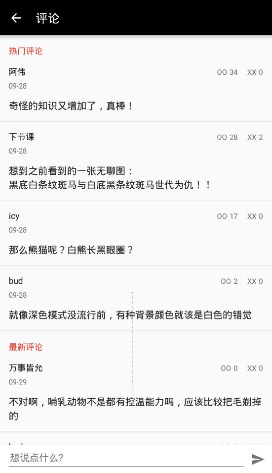

### 新鲜事

* 列表

* 详情

  * 

  * 接口：https://i.jandan.net/?oxwlxojflwblxbsapi=get_post&id=109648&include=content,date,modified

  * 获取评论列表：https://i.jandan.net/?oxwlxojflwblxbsapi=get_post&id=109542&include=comments

    * 列表倒叙展示，第一条为最新评论，有赞则为热门评论，按照赞数降序排列

    * ``` json
      {
      	"status": "ok",
      	"post": {
      		"id": 109542,
      		"comments": [{
      			"id": 5037477,
      			"name": "阿伟",
      			"url": "",
      			"date": "2021-09-28 11:13:24",
      			"content": "<p>奇怪的知识又增加了，真棒！<\/p>\n",
      			"parent": 0,
      			"vote_positive": 34,
      			"vote_negative": 0,
      			"index": 1
      		}, {
      			"id": 5037620,
      			"name": "下节课",
      			"url": "",
      			"date": "2021-09-28 12:55:45",
      			"content": "<p>想到之前看到的一张无聊图：<br \/>\n黑底白条纹斑马与白底黑条纹斑马世代为仇！！<\/p>\n",
      			"parent": 0,
      			"vote_positive": 28,
      			"vote_negative": 2,
      			"index": 2
      		}, {
      			"id": 5037683,
      			"name": "icy",
      			"url": "",
      			"date": "2021-09-28 14:08:50",
      			"content": "<p>那么熊猫呢？白熊长黑眼圈？<\/p>\n",
      			"parent": 0,
      			"vote_positive": 17,
      			"vote_negative": 0,
      			"index": 3
      		}, {
      			"id": 5038074,
      			"name": "bud",
      			"url": "",
      			"date": "2021-09-28 22:24:21",
      			"content": "<p>就像深色模式没流行前，有种背景颜色就该是白色的错觉<\/p>\n",
      			"parent": 0,
      			"vote_positive": 2,
      			"vote_negative": 0,
      			"index": 4
      		}, {
      			"id": 5038248,
      			"name": "万事皆允",
      			"url": "",
      			"date": "2021-09-29 08:46:59",
      			"content": "<p>不对啊，哺乳动物不是都有控温能力吗，应该比较把毛剃掉的<\/p>\n",
      			"parent": 0,
      			"vote_positive": 0,
      			"vote_negative": 0,
      			"index": 5
      		}]
      	},
      	"previous_url": "http:\/\/i.jandan.net\/p\/109608",
      	"next_url": "http:\/\/i.jandan.net\/p\/109640"
      }
      ```

    * 

### 随手拍

* 列表
  * 接口：https://api.jandan.net/api/v1/comment/list/21183
* 详情：
  * 获取评论列表：https://api.jandan.net/api/v1/tucao/list/5038743
    * data.host热门评论，正序展示
    * data.list 最新评论， 倒序展示
  * 就是评论列表+列表接口返回的数据
    * 

